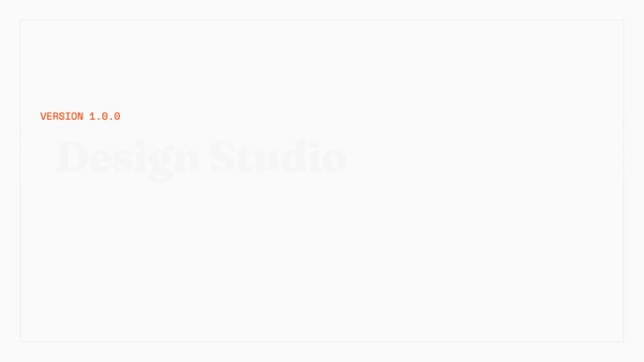

# Design Studio

A design harness that makes better-looking websites. It works great with Claude Code and can run in other agent harnesses too. It splits the work into four jobs (planning, design, building, and checking) so you get original designs, not boring templates.

**[See how it works →](https://george-rd.github.io/design-studio/)**

[](https://ko-fi.com/george_builds)

<p align="center">
  
  <br/>
  <em>23-second overview: how Design Studio defeats code-anchoring bias</em>
</p>

## The Problem

When you ask AI to build a website, it usually makes the same thing every time: a centered headline, a button, some cards in a grid. It looks fine, but it's boring. Every AI site starts to look the same.

The reason is **code-anchoring bias**. When the AI reads its own code before making changes, it just tweaks what's already there. It never stops to think "what should this really look like?"

## How It Works

Design Studio splits the work into four separate jobs. Each job is done by a different agent that only sees what it needs to see.

| Agent | Job | Why It's Separate |
|-------|-----|-------------------|
| **Planner** | Turns your idea into a full plan | Stops vague requests from causing bad results |
| **Design Agent** | Describes what the page should look like, in words, not code | Never sees code, so it can't copy old ideas |
| **Implementation Agent** | Builds real code from the design description | Follows the design exactly, no shortcuts |
| **Evaluator** | Opens the page in a real browser, clicks around, and scores it | Judges only what users see, not how hard the code was to write |

The loop: **Plan → Design → Build → Check → Decide → Repeat**.

Each round makes the design better. The evaluator checks each section of the page separately and tries to break things on purpose. When the scores are high enough, it ships the best version.

## What You Need

- **Primary path:** Claude Code installed and logged in, with a way to open pages in a real browser (Claude Code's claude-in-chrome MCP, or another browser tool).
- **Portable path:** Any agent harness that can run the workflow file and the helper agent prompts in `agents/`. That includes OMP, Codex, Cursor, and similar tools. You just need a browser tool and a way to run helper agents.

## Install

```bash
# From GitHub
claude plugin install https://github.com/George-RD/design-studio

# Or load it for one session
claude --plugin-dir ./design-studio
```

After installing, run `/reload-plugins` in Claude Code.

## Quick Start

In Claude Code, type:

```
/design-studio:create a landing page for a small coffee shop
```

The tool will:
1. **Plan**: Turn your idea into a full spec with a look and feel
2. **Design**: The Design Agent describes what the page should look like (no code)
3. **Build**: The Implementation Agent builds it from the description
4. **Check**: The Evaluator opens the page in a browser, takes screenshots, and scores it
5. **Decide**: Keep improving, start over, or ship it
6. **Loop**: Repeat until the design is good enough
7. **Codify**: Turn the winning direction into a reusable design system: `harness-output/design-system/design-dna.md`, `tokens.css`, and an installable skill template

All the work is saved in a folder called `harness-output/`. The final design system lives in `harness-output/design-system/`.

## Commands

| Command | What It Does |
|---------|-------------|
| `/design-studio:create <your prompt>` | Run the full design loop |

## How Scoring Works

The evaluator scores your page on four things:

| What It Checks | Weight | What It Means |
|----------------|--------|---------------|
| Design Quality | 2x | Does it look good together? |
| Originality | 2x | Does it look like every other site? |
| Craft | 1x | Is the code clean and polished? |
| Functionality | 1x | Can people use it? |

Design quality and originality matter most. AI is already good at making things that work. The hard part is making things that stand out.

## What Makes It Different

- **No more template websites.** Most AI tools make the same layout over and over. Design Studio stops that by separating the person who dreams up the design from the person who writes the code.
- **Real browser testing.** The evaluator opens your page in Chrome, clicks buttons, scrolls, and checks for bugs. It doesn't just read the code.
- **Zone-by-zone scoring.** Instead of giving the whole page one score, it checks each section separately. A broken footer can't hide behind a pretty hero section.
- **Tries to break things.** Before scoring, the evaluator checks for text that overflows, buttons that don't work, and layouts that fall apart on mobile.

## Where It Comes From

Based on research from Anthropic Labs about "harness design for long-running application development." The key insight: separating the creative eye from the code writer produces much better results than a single agent doing everything.

## License

MIT
