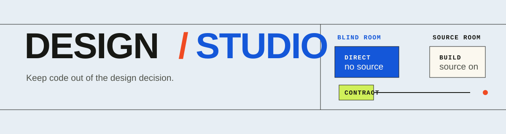
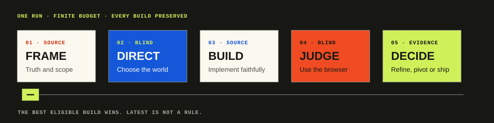

<picture>
  
</picture>

<p align="center">
  <a href="https://george-rd.github.io/design-studio/"><strong>See the workflow</strong></a>
  ·
  <a href="#install"><strong>Install</strong></a>
  ·
  <a href="ROADMAP.md"><strong>Roadmap</strong></a>
  ·
  <a href="https://github.com/George-RD/design-studio/issues"><strong>Issues</strong></a>
</p>

# Design Studio

Design Studio keeps visual direction and evaluation away from source code. The Builder sees the implementation. The agents choosing and judging the design do not.

Code can implement the idea. It does not get to choose it.

<picture>
  
</picture>

## The split

| Room | Roles | What it can see |
|---|---|---|
| **Source room** | Planner, Builder | Product files, source, routes, assets and implementation constraints |
| **Blind room** | Visual Director, Evaluator | Product truth, screenshots, the live page and scoped critique |
| **Decision owner** | Orchestrator | Run evidence, budgets, findings and preserved iterations |

The Evaluator reports what happened in the browser. It cannot decide to refine, pivot or ship. The Orchestrator applies the recorded rules.

## Use it

With the Agent Skill installed, ask a capable host to use Design Studio directly:

```text
Use Design Studio to create a landing page for a small coffee shop.
```

Claude Code can expose the same skill through its optional adapter:

```text
/design-studio:create a landing page for a small coffee shop
/design-studio:create --overhaul ./site --goals "keep the information architecture" replace the visual direction
/design-studio:review ./site
```

The skill owns input mapping, isolated roles and workflow rules. Host adapters only translate invocation. A standard run gets four builds, and the best eligible build wins even when it is not the latest one.

## What a run records

- `roots.json` anchors the repository, app and product context before work starts.
- `capabilities.json` records the browser, server, detector and interaction tools that were actually available.
- `events.jsonl` makes each step resumable without overwriting completed work.
- Every direction, build, screenshot, finding and decision stays under one immutable run folder.
- Mechanical checks and blind browser judgement remain separate.
- The accepted build becomes `DESIGN.md`, design DNA and reusable tokens.

`COPY.md` is optional. When present, it carries durable voice, claim and terminology rules into the surface brief. Growth Arsenal may provide separate offer or copy inputs when both skills are present; it is not required to install or start Design Studio.

## Install

Canonical Agent Skill install:

```bash
npx skills add George-RD/design-studio
```

Claude Code plugin support remains an optional convenience:

```text
/plugin marketplace add George-RD/design-studio
/plugin install design-studio@design-studio
/reload-plugins
```

The Claude CLI equivalents are:

```bash
claude plugin marketplace add George-RD/design-studio
claude plugin install design-studio@design-studio
```

## Run output

```text
harness-output/
├── runs/<run-id>/
│   ├── roots.json, capabilities.json, events.jsonl
│   ├── spec.md, sprint-contract.md, surface-brief.md
│   ├── iterations/<n>/
│   │   ├── direction/
│   │   ├── site/
│   │   ├── mechanical-findings.json
│   │   └── screenshots/, observation.json, critique.md
│   └── finish/
├── site/
├── design-system/
└── report.md
```

Completed iterations are immutable. A failed or interrupted run resumes from the first incomplete step after its recorded artifacts pass validation.

## Current compatibility and v1.6 direction

In the current v1.5 release, Impeccable is optional. When its CLI is available, Design Studio uses source, desktop and mobile detector passes for mechanical preflight. Without it, the workflow records `detector: fallback` and runs a smaller browser-computed gate.

The v1.6 roadmap removes this environment-dependent split. It targets one self-contained Design Studio runtime with a curated local method kernel. External systems are research inputs. Impeccable and Emil Kowalski's skills are credited sources, not install requirements. Growth Arsenal remains a separate optional skill for offer and copy work. See [ADR 0002](docs/decisions/0002-owned-method-kernel.md).

Mechanical findings remain evidence. They never substitute for source-blind judgement of the rendered result.

## Requirements

- File and shell access.
- Isolated subagents.
- A runnable target or valid `serve.json` contract.
- Browser automation for a complete Studio decision. Without it, Design Studio can preserve one unselected build and the mechanical evidence, but it will not invent a visual verdict.

## Licence

MIT. Attribution and licence notes for Impeccable and Emil Kowalski's skills are recorded in `NOTICE.md`; neither is required to install Design Studio.
